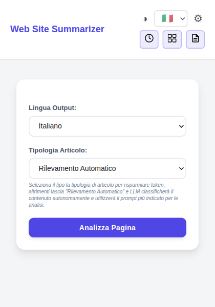
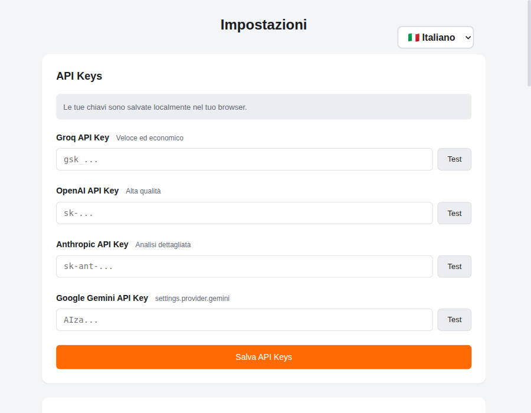
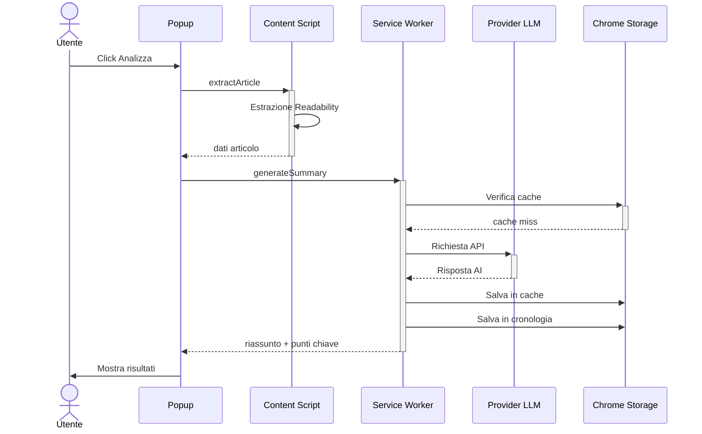
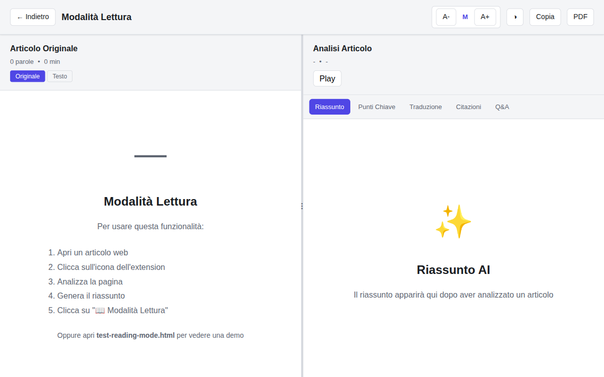
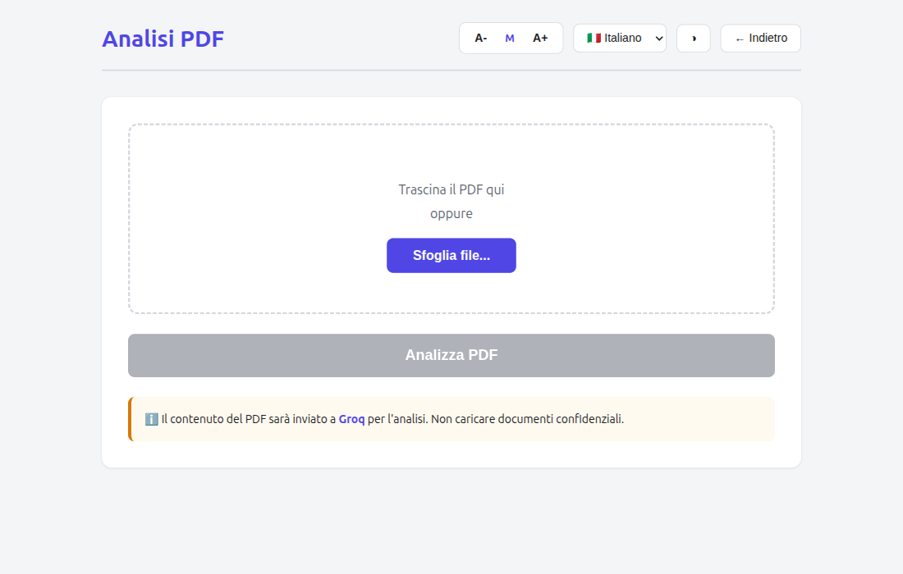
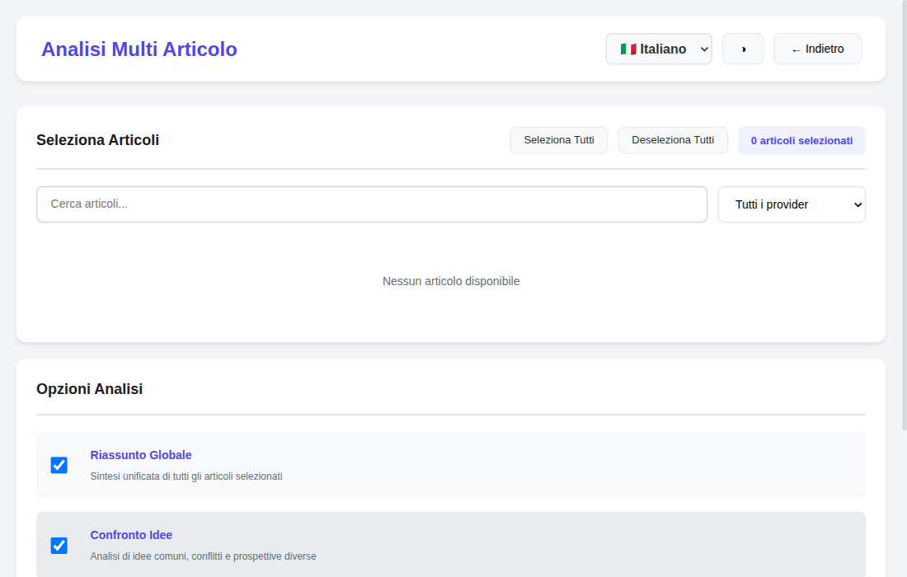
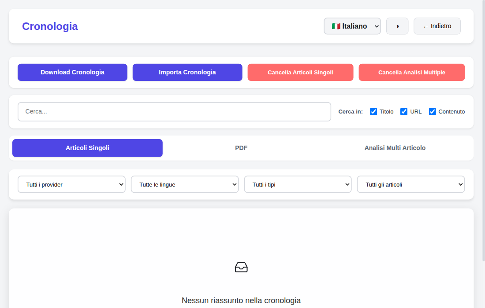
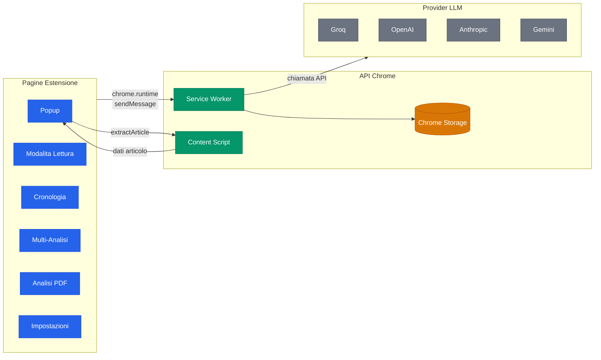

<p align="center">
  
</p>

<h1 align="center">Web Article Summarizer</h1>

<p align="center">
  Un'estensione Chrome per riassumere articoli web e PDF con l'AI.<br/>
  Supporta Groq, OpenAI, Anthropic (Claude) e Google Gemini.
</p>

<p align="center">
  Italiano · <a href="README.md">English</a>
</p>

<div align="center">

[](https://github.com/AndreaBonn/web-article-summarizer/actions/workflows/ci.yml)
[](https://github.com/AndreaBonn/web-article-summarizer/actions/workflows/ci.yml)
[](LICENSE)
[](https://eslint.org)
[](https://prettier.io)
[](SECURITY.md)


</div>

<p align="center">
  
</p>

---

## Indice

- [Funzionalità](#funzionalità)
- [Provider Supportati](#provider-supportati)
- [Installazione](#installazione)
- [Utilizzo](#utilizzo)
- [Scorciatoie da Tastiera](#scorciatoie-da-tastiera)
- [Formati di Esportazione](#formati-di-esportazione)
- [Lingue](#lingue)
- [Stack Tecnologico](#stack-tecnologico)
- [Architettura](#panoramica-architettura)
- [Sviluppo](#sviluppo)
- [Struttura del Progetto](#struttura-del-progetto)
- [Sicurezza](#sicurezza)
- [Contribuire](#contribuire)
- [Autore](#autore)

---

## Funzionalità

**Analisi Articoli**

- Riassunto con un click da qualsiasi pagina web
- Estrazione dei punti chiave per una lettura rapida
- Rilevamento automatico del tipo di contenuto (news, scientifico, tutorial, business, opinione)
- Lunghezza del riassunto regolabile (breve, medio, dettagliato)

**Traduzione e Citazioni**

- Traduzione completa dell'articolo in 5 lingue
- Estrazione citazioni bibliografiche con formattazione APA
- Matching delle fonti e riferimenti a livello di paragrafo

**Modalità Lettura**

- Vista affiancata: articolo originale + analisi AI
- Pannelli ridimensionabili con divisore trascinabile
- Controllo dimensione font e tema chiaro/scuro

**Analisi Multi-Articolo**

- Confronto e analisi simultanea di più articoli
- Q&A trasversale tra articoli
- Generazione di riassunti consolidati

**Analisi PDF**

- Caricamento e analisi di documenti PDF
- Estrazione testo con caching intelligente
- Pipeline di analisi completa (riassunto, punti chiave, traduzione, citazioni)

**Controlli Vocali**

- Text-to-Speech: ascolta riassunti e analisi
- Speech-to-Text: fai domande usando la voce

**Cronologia ed Esportazione**

- Cronologia automatica con ricerca, filtri e preferiti
- Esportazione in PDF, Markdown o Email
- Import/export della cronologia come backup JSON

**Funzionalità Avanzate**

- Cache delle risposte per accesso rapido
- Compressione dati per storage efficiente
- Fallback automatico tra provider
- Tema chiaro e scuro su tutte le pagine

---

## Provider Supportati

| Provider                                     | Modello           | Piano Gratuito |
| -------------------------------------------- | ----------------- | -------------- |
| [Groq](https://console.groq.com)             | Llama 3.3 70B     | Si             |
| [OpenAI](https://platform.openai.com)        | GPT-4o            | No             |
| [Anthropic](https://console.anthropic.com)   | Claude 3.5 Sonnet | No             |
| [Google Gemini](https://aistudio.google.com) | Gemini 2.5 Pro    | Si             |

Ogni provider richiede la propria API key. Puoi configurare più provider e passare da uno all'altro.

<p align="center">
  
</p>

---

## Installazione

### Da Sorgente (Modalità Sviluppatore)

1. **Clona il repository**

   ```bash
   git clone https://github.com/AndreaBonn/web-article-summarizer.git
   cd web-article-summarizer
   ```

2. **Installa le dipendenze**

   ```bash
   npm install
   ```

3. **Compila l'estensione**

   ```bash
   npm run build
   ```

4. **Carica in Chrome**
   - Apri `chrome://extensions/`
   - Attiva la **Modalità sviluppatore** (toggle in alto a destra)
   - Clicca **Carica estensione non pacchettizzata**
   - Seleziona la cartella `dist/`

5. **Configura le API key**
   - Clicca l'icona dell'estensione nella barra degli strumenti
   - Vai nelle Impostazioni
   - Inserisci almeno una API key

---

## Utilizzo

### Come Funziona



### Riassumere un Articolo

1. Naviga su un qualsiasi articolo o blog post
2. Clicca l'icona dell'estensione nella barra di Chrome
3. Seleziona il provider e la lingua preferiti
4. Clicca **Analizza Pagina**
5. Visualizza il riassunto, i punti chiave e altro nel popup

### Modalità Lettura

Dopo aver generato un riassunto, clicca **Modalità Lettura** per aprire una vista a schermo intero con l'articolo originale a sinistra e l'analisi AI a destra.

<p align="center">
  
</p>

### Tradurre un Articolo

1. Genera prima un riassunto
2. Passa al tab **Traduzione**
3. Clicca **Traduci Articolo**

### Estrarre Citazioni

1. Genera prima un riassunto
2. Passa al tab **Citazioni**
3. Clicca **Estrai Citazioni**
4. Le citazioni sono formattate in stile APA con matching delle fonti

### Fare Domande (Q&A)

Scrivi una domanda nella sezione Q&A in fondo al popup oppure usa il pulsante microfono per l'input vocale. L'AI risponderà basandosi sul contenuto dell'articolo.

### Analizzare un PDF

1. Clicca l'icona dell'estensione
2. Vai su **Analisi PDF**
3. Trascina o sfoglia per selezionare un file PDF
4. Seleziona provider e lingua
5. Clicca **Analizza**

<p align="center">
  
</p>

### Confrontare Più Articoli

1. Analizza diversi articoli (vengono salvati nella cronologia)
2. Clicca l'icona dell'estensione
3. Vai su **Analisi Multi Articolo**
4. Seleziona 2+ articoli dalla lista
5. Scegli il tipo di analisi (riassunto, confronto, Q&A)
6. Clicca **Avvia Analisi**

<p align="center">
  
</p>

### Cronologia

Tutti gli articoli analizzati vengono salvati automaticamente in una cronologia ricercabile. Puoi filtrare per provider, lingua, tipo di contenuto o stato dell'articolo. La cronologia supporta import/export in formato JSON per backup e migrazione.

<p align="center">
  
</p>

---

## Scorciatoie da Tastiera

| Scorciatoia | Azione                                                  |
| ----------- | ------------------------------------------------------- |
| `A-` / `A+` | Diminuisci / aumenta dimensione font (Modalità Lettura) |

---

## Formati di Esportazione

| Formato      | Descrizione                                                  |
| ------------ | ------------------------------------------------------------ |
| **PDF**      | Documento formattato con tutte le sezioni di analisi         |
| **Markdown** | Testo strutturato con intestazioni e formattazione           |
| **Email**    | Apre il client email predefinito con contenuto pre-compilato |
| **Copia**    | Copia l'analisi negli appunti                                |
| **JSON**     | Import/export della cronologia per backup                    |

---

## Lingue

L'interfaccia dell'estensione è disponibile in:

- Inglese
- Italiano
- Spagnolo
- Francese
- Tedesco

L'output dell'analisi può essere generato in qualsiasi di queste lingue, indipendentemente dalla lingua dell'articolo originale.

---

## Stack Tecnologico

| Categoria            | Tecnologia                     |
| -------------------- | ------------------------------ |
| Piattaforma          | Chrome Extension (Manifest V3) |
| Build                | Vite + @crxjs/vite-plugin      |
| Estrazione Contenuto | @mozilla/readability           |
| Parsing PDF          | pdfjs-dist                     |
| Export PDF           | jspdf                          |
| Compressione         | lz-string                      |
| Testing              | Vitest + jsdom                 |
| Linting              | ESLint (flat config)           |
| Formattazione        | Prettier                       |
| CI/CD                | GitHub Actions                 |

### Panoramica Architettura



Per i diagrammi architetturali dettagliati (pipeline AI, layer storage, tipi di messaggi), vedi [docs/ARCHITECTURE.md](docs/ARCHITECTURE.md).

---

## Sviluppo

### Prerequisiti

- Node.js 22+
- npm

### Comandi

```bash
# Installa dipendenze
npm install

# Server di sviluppo con HMR
npm run dev

# Build di produzione
npm run build

# Esegui test
npm run test

# Esegui test in modalità watch
npm run test:watch

# Lint
npm run lint

# Formatta codice
npm run format
```

### Workflow di Sviluppo

1. Esegui `npm run dev` per avviare il server di sviluppo
2. Carica la cartella `dist/` in Chrome come estensione non pacchettizzata
3. Le modifiche ai file sorgente attiveranno l'hot module replacement
4. Esegui `npm run test` prima di ogni commit

---

## Struttura del Progetto

```
src/
├── background/          Service worker (modulo ES)
├── content/             Content script
├── pages/
│   ├── popup/           Popup principale dell'estensione
│   ├── reading-mode/    Vista lettura a schermo intero
│   ├── history/         Cronologia analisi
│   ├── multi-analysis/  Confronto multi-articolo
│   ├── pdf-analysis/    Analisi documenti PDF
│   └── options/         Impostazioni e API key
├── shared/styles/       CSS condiviso (base.css, voice-controls.css)
└── utils/
    ├── ai/              Client API LLM, prompt, citazioni
    ├── storage/         Chrome storage, cache, compressione
    ├── export/          Export PDF, Markdown, email
    ├── pdf/             Parsing e caching PDF
    ├── i18n/            Internazionalizzazione (5 lingue)
    ├── voice/           Controller TTS e STT
    ├── security/        Sanitizzazione HTML e input
    └── core/            Tema, modal, logger, errori
```

---

## Permessi

L'estensione richiede i seguenti permessi Chrome:

| Permesso    | Motivazione                                                      |
| ----------- | ---------------------------------------------------------------- |
| `activeTab` | Accedere al tab corrente per estrarre il contenuto dell'articolo |
| `storage`   | Salvare impostazioni, cronologia e dati in cache localmente      |
| `scripting` | Iniettare content script per l'estrazione dell'articolo          |
| `tts`       | Text-to-Speech per leggere i riassunti ad alta voce              |

Le chiamate API vengono effettuate direttamente agli endpoint dei provider. Nessun dato viene inviato a server terzi oltre al provider AI selezionato.

---

## Sicurezza

Questa estensione implementa un'architettura di sicurezza completa e multi-livello che include prevenzione XSS, difesa contro prompt injection (5 lingue), Content Security Policy restrittiva, sandboxing iframe e molto altro.

Per la panoramica completa sulla sicurezza, vedi **[SECURITY.it.md](SECURITY.it.md)**.

Per segnalare una vulnerabilità, segui il [processo di divulgazione responsabile](SECURITY.it.md#segnalare-una-vulnerabilità).

---

## Contribuire

I contributi sono benvenuti. Per favore:

1. Fai un fork del repository
2. Crea un branch per la feature (`git checkout -b feature/la-mia-feature`)
3. Committa le modifiche (`git commit -m 'feat: aggiungi la mia feature'`)
4. Pusha il branch (`git push origin feature/la-mia-feature`)
5. Apri una Pull Request

Assicurati che tutti i test passino e il linting sia pulito prima di inviare.

---

## Autore

**Andrea Bonacci** — [@AndreaBonn](https://github.com/AndreaBonn)

---

## Licenza

Questo progetto è distribuito sotto licenza Apache 2.0. Vedi il file [LICENSE](LICENSE) per i dettagli.

Se utilizzi o redistribuisci questo software, devi mantenere la nota di copyright e fornire attribuzione all'autore originale.

---

Se questo progetto ti è stato utile, lascia una stella su GitHub — aiuta altri a scoprirlo e motiva lo sviluppo continuo.
