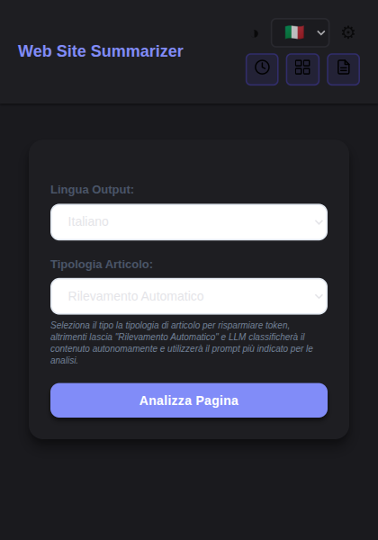

<p align="center">
  
</p>

<h1 align="center">Web Article Summarizer</h1>

<p align="center">
  A Chrome Extension that summarizes web articles and PDFs using AI.<br/>
  Supports Groq, OpenAI, Anthropic (Claude), and Google Gemini.
</p>

<p align="center">
  <a href="README.it.md">Italiano</a> · English
</p>

<div align="center">

[](https://github.com/AndreaBonn/web-article-summarizer/actions/workflows/ci.yml)
[](https://github.com/AndreaBonn/web-article-summarizer/actions/workflows/ci.yml)
[](https://github.com/AndreaBonn/web-article-summarizer/actions/workflows/ci.yml)
[](LICENSE)
[](https://eslint.org)
[](https://prettier.io)
[](SECURITY.md)


</div>

<p align="center">
  
  &nbsp;&nbsp;&nbsp;&nbsp;
  
</p>

---

## Table of Contents

- [Features](#features)
- [Supported Providers](#supported-providers)
- [Installation](#installation)
- [Usage](#usage)
- [Export Formats](#export-formats)
- [Languages](#languages)
- [Tech Stack](#tech-stack)
- [Development](#development)
- [Project Structure](#project-structure)
- [Permissions](#permissions)
- [Security](#security)
- [Contributing](#contributing)
- [Author](#author)

---

## Features

**Article Analysis**

- One-click article summarization from any web page
- Key points extraction for quick reading
- Content-type auto-detection (news, scientific, tutorial, business, opinion)
- Adjustable summary length (short, medium, detailed)

**Translation & Citations**

- Full article translation across 5 languages
- Bibliographic citation extraction with APA formatting
- Source matching and paragraph-level referencing

**Reading Mode**

- Side-by-side view: original article + AI analysis
- Resizable panels with draggable divider
- Font size controls and dark/light theme

**Multi-Article Analysis**

- Compare and analyze multiple articles simultaneously
- Cross-article Q&A
- Consolidated summary generation

**PDF Analysis**

- Upload and analyze PDF documents
- Text extraction with intelligent caching
- Full analysis pipeline (summary, key points, translation, citations)

**Voice Controls**

- Text-to-Speech: listen to summaries and analysis
- Speech-to-Text: ask questions using your voice

**History & Export**

- Automatic history with search, filters, and favorites
- Export to PDF, Markdown, or Email
- Import/export history as JSON backup

**Smart Features**

- Response caching for faster repeat access
- Data compression for efficient storage
- Automatic fallback between providers
- Dark and light theme across all pages

---

## Supported Providers

| Provider                                     | Model             | Free Tier |
| -------------------------------------------- | ----------------- | --------- |
| [Groq](https://console.groq.com)             | Llama 3.3 70B     | Yes       |
| [OpenAI](https://platform.openai.com)        | GPT-4o            | No        |
| [Anthropic](https://console.anthropic.com)   | Claude 3.5 Sonnet | No        |
| [Google Gemini](https://aistudio.google.com) | Gemini 2.5 Pro    | Yes       |

Each provider requires its own API key. You can configure multiple providers and switch between them.

<p align="center">
  
</p>

---

## Installation

### From Source (Developer Mode)

1. **Clone the repository**

   ```bash
   git clone https://github.com/AndreaBonn/web-article-summarizer.git
   cd web-article-summarizer
   ```

2. **Install dependencies**

   ```bash
   npm install
   ```

3. **Build the extension**

   ```bash
   npm run build
   ```

4. **Load in Chrome**
   - Open `chrome://extensions/`
   - Enable **Developer mode** (toggle in the top right)
   - Click **Load unpacked**
   - Select the `dist/` folder

5. **Configure API keys**
   - Click the extension icon in the toolbar
   - Go to Settings
   - Enter at least one API key

---

## Usage

### Summarize an Article

1. Navigate to any article or blog post
2. Click the extension icon in the Chrome toolbar
3. Select your preferred provider and language
4. Click **Analyze Page**
5. View the summary, key points, and more in the popup

### Reading Mode

After generating a summary, click **Reading Mode** to open a full-page side-by-side view with the original article on the left and the AI analysis on the right.

<p align="center">
  
</p>

### Translate an Article

1. Generate a summary first
2. Switch to the **Translation** tab
3. Click **Translate Article**

### Extract Citations

1. Generate a summary first
2. Switch to the **Citations** tab
3. Click **Extract Citations**
4. Citations are formatted in APA style with source matching

### Ask Questions (Q&A)

Type a question in the Q&A section at the bottom of the popup or use the microphone button for voice input. The AI will answer based on the article content.

### Analyze a PDF

1. Click the extension icon
2. Go to **PDF Analysis**
3. Drag & drop or browse for a PDF file
4. Select provider and language
5. Click **Analyze**

<p align="center">
  
</p>

### Compare Multiple Articles

1. Analyze several articles (they are saved in history)
2. Click the extension icon
3. Go to **Multi-Article Analysis**
4. Select 2+ articles from the list
5. Choose analysis type (summary, comparison, Q&A)
6. Click **Start Analysis**

<p align="center">
  
</p>

### History

All analyzed articles are automatically saved in a searchable history. You can filter by provider, language, content type, or article status. History supports import/export as JSON for backup and migration.

<p align="center">
  
</p>

---

## Export Formats

| Format       | Description                                        |
| ------------ | -------------------------------------------------- |
| **PDF**      | Formatted document with all analysis sections      |
| **Markdown** | Structured text with headers and formatting        |
| **Email**    | Opens default email client with pre-filled content |
| **Copy**     | Copies analysis to clipboard                       |
| **JSON**     | History import/export for backup                   |

---

## Languages

The extension interface is available in:

- English
- Italian
- Spanish
- French
- German

Article analysis output can be generated in any of these languages regardless of the source article language.

---

## Tech Stack

| Category           | Technology                     |
| ------------------ | ------------------------------ |
| Platform           | Chrome Extension (Manifest V3) |
| Build              | Vite + @crxjs/vite-plugin      |
| Content Extraction | @mozilla/readability           |
| PDF Parsing        | pdfjs-dist                     |
| PDF Export         | jspdf                          |
| Compression        | lz-string                      |
| Testing            | Vitest + jsdom                 |
| Linting            | ESLint (flat config)           |
| Formatting         | Prettier                       |
| CI/CD              | GitHub Actions                 |

---

## Development

### Prerequisites

- Node.js 22+
- npm

### Commands

```bash
# Install dependencies
npm install

# Development server with HMR
npm run dev

# Production build
npm run build

# Run tests
npm run test

# Run tests in watch mode
npm run test:watch

# Lint
npm run lint

# Format code
npm run format
```

### Development Workflow

1. Run `npm run dev` to start the development server
2. Load the `dist/` folder in Chrome as an unpacked extension
3. Changes to source files will trigger hot module replacement
4. Run `npm run test` before committing

---

## Project Structure

```
src/
├── background/          Service worker (ES module)
├── content/             Content script
├── pages/
│   ├── popup/           Main extension popup
│   ├── reading-mode/    Full-page reading view
│   ├── history/         Analysis history
│   ├── multi-analysis/  Multi-article comparison
│   ├── pdf-analysis/    PDF document analysis
│   └── options/         Settings & API keys
├── shared/styles/       Shared CSS (base.css, voice-controls.css)
└── utils/
    ├── ai/              LLM API client, prompts, citations
    ├── storage/         Chrome storage, cache, compression
    ├── export/          PDF, Markdown, email export
    ├── pdf/             PDF parsing & caching
    ├── i18n/            Internationalization (5 locales)
    ├── voice/           TTS & STT controllers
    ├── security/        HTML & input sanitization
    └── core/            Theme, modal, logger, errors
```

---

## Permissions

The extension requests the following Chrome permissions:

| Permission  | Reason                                            |
| ----------- | ------------------------------------------------- |
| `activeTab` | Access the current tab to extract article content |
| `storage`   | Save settings, history, and cached data locally   |
| `scripting` | Inject content scripts for article extraction     |
| `tts`       | Text-to-Speech for reading summaries aloud        |

API calls are made directly to provider endpoints. No data is sent to third-party servers beyond the selected AI provider.

---

## Security

This extension implements a comprehensive, multi-layered security architecture including XSS prevention, prompt injection defense (5 languages), strict Content Security Policy, iframe sandboxing, and more.

For the full security overview, see **[SECURITY.md](SECURITY.md)**.

To report a vulnerability, please follow the [responsible disclosure process](SECURITY.md#reporting-a-vulnerability).

---

## Contributing

Contributions are welcome. Please:

1. Fork the repository
2. Create a feature branch (`git checkout -b feature/my-feature`)
3. Commit your changes (`git commit -m 'feat: add my feature'`)
4. Push to the branch (`git push origin feature/my-feature`)
5. Open a Pull Request

Make sure all tests pass and linting is clean before submitting.

---

## Author

**Andrea Bonacci** — [@AndreaBonn](https://github.com/AndreaBonn)

---

## License

This project is licensed under the Apache License 2.0. See the [LICENSE](LICENSE) file for details.

If you use or redistribute this software, you must retain the copyright notice and provide attribution to the original author.

---

If you find this project useful, please consider giving it a star on GitHub — it helps others discover it and motivates continued development.
