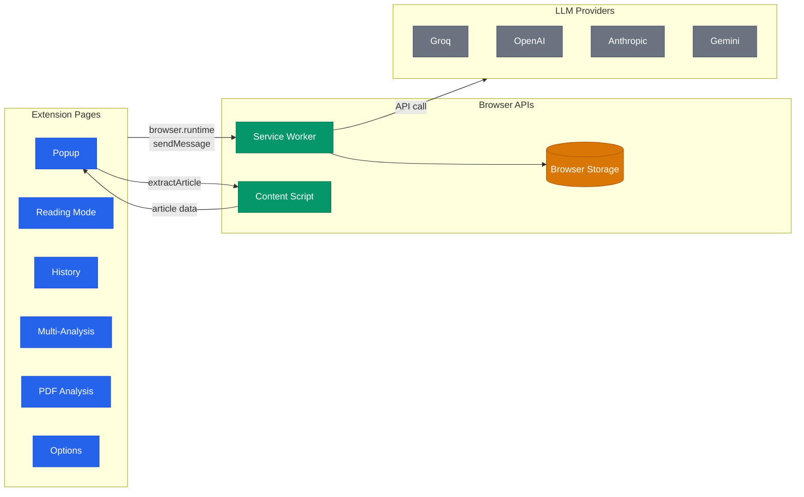
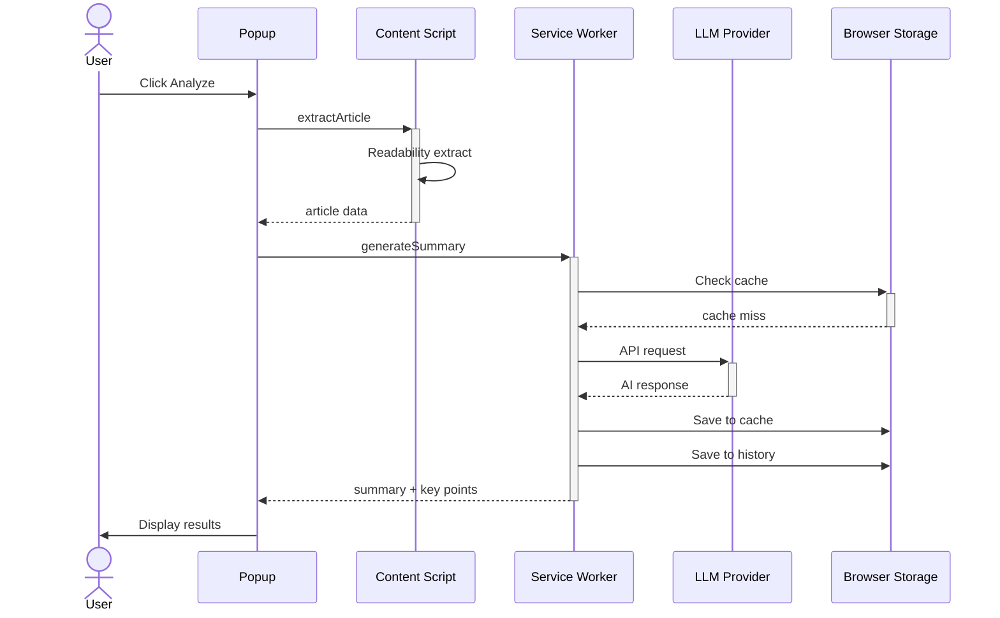
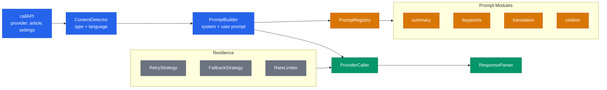
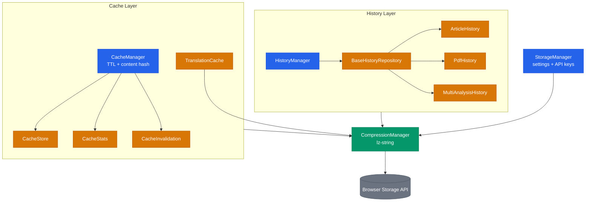

# Architecture

Technical reference for the internal architecture of Web Article Summarizer.

## Extension Architecture

How the Firefox Extension components communicate. Pages send messages to the Service Worker via `browser.runtime.sendMessage`. The Popup also communicates with the Content Script via `browser.tabs.sendMessage` for article extraction.

**Legend:** Blue = UI pages, Green = browser runtime components, Amber = storage, Grey = external providers.

## Article Analysis Flow

The main user flow from clicking "Analyze" to seeing results. The Service Worker checks the cache before calling the LLM provider, and saves both cache and history on success.

### Message Types

The Service Worker handles these message actions via `browser.runtime.onMessage`:

| Action                | Direction                 | Description                           |
| --------------------- | ------------------------- | ------------------------------------- |
| `extractArticle`      | Popup -> Content Script   | Extract article from current page DOM |
| `generateSummary`     | Page -> Service Worker    | Generate AI summary                   |
| `extractCitations`    | Page -> Service Worker    | Extract bibliographic citations       |
| `translateArticle`    | Page -> Service Worker    | Translate article content             |
| `askQuestion`         | Page -> Service Worker    | Q&A on article content                |
| `translatePDF`        | Page -> Service Worker    | Translate PDF content                 |
| `extractPDFCitations` | Page -> Service Worker    | Extract citations from PDF            |
| `askPDFQuestion`      | Page -> Service Worker    | Q&A on PDF content                    |
| `testApiKey`          | Options -> Service Worker | Validate provider API key             |

## AI Processing Pipeline

How `APIOrchestrator.callAPI` processes a request internally. Content detection feeds into prompt building, which uses the PromptRegistry facade to select the right prompt module. The ProviderCaller dispatches to one of 4 LLM providers with retry and fallback support.

### Default Models

| Provider  | Model                        |
| --------- | ---------------------------- |
| Groq      | `llama-3.3-70b-versatile`    |
| OpenAI    | `gpt-4o`                     |
| Anthropic | `claude-sonnet-4-5-20250514` |
| Gemini    | `gemini-2.5-pro`             |

## Storage Architecture

All persistent data flows through CompressionManager (lz-string) before reaching Browser Storage. CacheManager handles response caching with content hash validation and TTL. HistoryManager delegates to specialized repositories per content type.

**Legend:** Blue = manager facades, Amber = data stores/repositories, Green = processing, Grey = browser platform.
